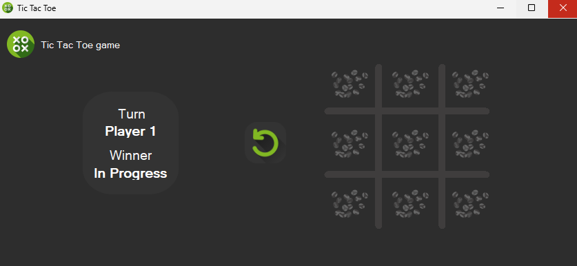
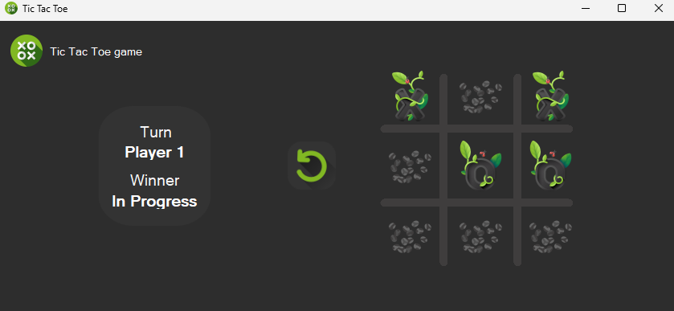
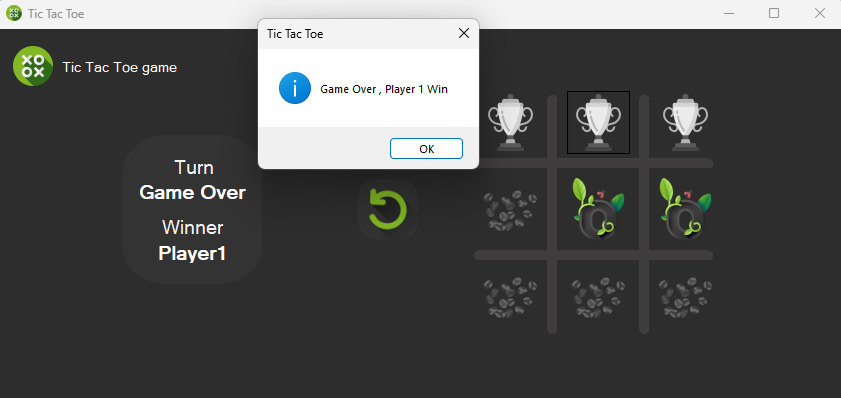

# 🎮 Tic Tac Toe – WinForms Game

## 📌 Overview

This is a simple 2-player Tic Tac Toe game developed in 2023 using C# and Windows Forms. It was one of my first attempts at building an interactive game-based UI, applying logic, state tracking, and basic drawing on the form.

---

## 🧠 Key Features

- 2-player turn-based gameplay
- Winner detection (rows, columns, diagonals)
- Custom background images for X, O, and win state
- UI update with real-time text fields for turn and winner
- Game reset functionality
- Drawing lines for the grid using GDI+

---

## 🧰 Technologies Used

- C# (.NET Framework)
- Windows Forms (WinForms)
- GDI+ for custom grid rendering
- Event-driven programming

---

## 🌱 What I Learned

- Structs and enums for managing game state
- Detecting win conditions with logic
- Drawing custom shapes on forms
- Updating UI components dynamically
- Managing player turns and preventing invalid moves

---

## 📷 Screenshot

---

## 🗒️ Notes

This game was built in 2023 as part of my foundational C# learning. It reflects my early progress with UI interaction, events, and logic structuring.  
It is now being archived and published in 2025 for portfolio and documentation purposes.
